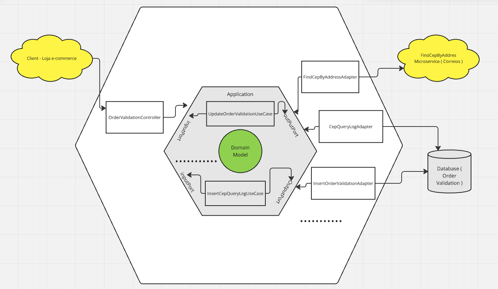

# API REST para atualização de CEP a partir de endereço do pedido com Spring Boot

<h2>Cenário Hipotético</h2>

Um e-commerce está com o cadastro de CEPs dos endereços dos pedidos de seus clientes desatualizado, devido a uma reestruturação da numeração dos ceps feita no Brasil, que irá tornar os ceps únicos por logradouro.

Sendo assim, para facilitar o processo, foi desenvolvida uma API que recebe dados básicos dos pedidos dos clientes e faz uma consulta, a partir de informações de endereço, ao cep que deverá ser utilizado para o pedido do cliente.

# Diagrama sintético da solução:

<p align="center">
  
</p>

# Diagrama sintético da arquitetura utilizada:

<p align="center">
  
</p>

# Foram desenvolvidas 4 operações básicas:

<h2>1 - Criação de validação da ordem (order validation): </h2>

Os dados básicos do pedido são inclusos, junto com o endereço nele constante, para que o cep correto seja encontrado.
Se o CEP for encontrado na API dos correios, então o status do order validation fica APPROVED, caso contrário, fica REJECTED.
Por conveniência, durante o procedimento de criação de um order validation, um status intermediário, PENDING, é utilizado, mas não permanece registrado no banco de dados.

<p align="center">
  
</p>

Exemplo: 

(POST) http://localhost:8081/api/v1/ordervalidation/

```
Body:

{
    "orderNumber": "1",
    "email": "teste@teste.com",
    "streetType": "Avenida",
    "street": "Paulista",
    "city": "São Paulo",
    "state": "SP"
}
```

<h2>2 - Obtenção de registro de validação da ordem (order validation):</h2>

<p align="center">
  
</p>

Exemplo:

(GET) http://localhost:8081/api/v1/ordervalidation/1

```
{
    "orderNumber": "1",
    "email": "teste@teste.com",
    "addressResponse": {
        "streetType": "Avenida",
        "street": "Paulista",
        "city": "São Paulo",
        "state": "SP",
        "cep": 01310200
        },
    "status": "APPROVED"
}

Nesse exemplo, o cep foi encontrado, então volta preenchido no campo cep e o status vem como APPROVED.
```
<h2>3 - Atualização de registro de validação da ordem (order validation):</h2>

Pode acontecer do endereço precisar de correção para ser encontrado corretamente no cadastro dos correios, devido a diferenças entre o cadastro do endereço no e-commerce e o registro correto nos correios, por isso, essa operação de atualização foi criada e só pode ser usada para order validations que não forem aprovados, ou seja, que ainda não tiveram seu cep definitivo encontrado.

<p align="center">
  
</p>

Exemplo:

(PUT) http://localhost:8081/api/v1/ordervalidation/1

```
{
    "orderNumber": "1",
    "email": "teste@teste.com",
    "streetType": "Avenida",
    "street": "Paulista",
    "city": "São Paulo",
    "state": "SP"
}

Se a ordem validation não for encontrada, é retornado um erro 404.
Se a ordem validation for encontrada, mas estiver APPROVED, ou seja, já com status indicando que há cep, é retornado erro 400.
```
<h2>4 - Exclusão de uma ordem validation:</h2>

A exclusão só pode ser feita se a ordem validation for encontrada e se ela não estiver APPROVED.
Se ela não for encontrada, é retornado erro 404.
Se a ordem validation for encontrada, mas estiver aprovada, é retornado erro 400.

<p align="center">
  
</p>

Exemplo:

(DELETE) http://localhost:8081/api/v1/ordervalidation/1

# Instruções para setup local, para fins de desenvolvimento e testes

<h2>Build e execução de um container docker para a API dos correios mockada com Wiremock</h2>

1. Certifique-se que tem o docker disponível na sua máquina de trabalho;
2. Acesse o diretório /docker-containers/wiremock-container do projeto;
3. Execute o comando abaixo para criar a imagem customizada do container, com os mappings personalizados para o API mockado;

```
docker build -t wiremock-custom .
```

4. Execute o container customizado da seguinte maneira: 

```
docker run -d --rm -p 8082:8082 --name wiremock wiremock-custom
```

<h2>Build e execução de um container docker para uso do banco de dados MySQL</h2>

1. Certifique-se que tem o docker disponível na sua máquina de trabalho;
2. Acesse o diretório /docker-containers/mysql-container do projeto;
3. Execute o comando abaixo para criar a imagem customizada do container, já com o banco de dados e tabelas necessárias criadas:

```
docker build -t custom-mysql .
```

4. Execute o container customizado da seguinte maneira:

```
docker run -d -p 3306:3306 --name mysql-container custom-mysql
```

# AWS

Considerações:

1 - Para usar MySQL na AWS, a abordagem com container docker não é recomendada. Ao invés disso, o melhor é usar o RDS em uma subnet privada.

2 - A manutenção de usuários e senhas em arquivos de configuração, como feito nesse exemplo, também não é recomendada, ao invés disso, é melhor usar o AWS Secrets Manager para rotacionar as senhas usando lambda functions, de forma a ter a mudança periodica da senha. O acesso para obtenção da senha deverá ser feito por SDK ou API.

3 - No exemplo, já foi criado um usuário root para o banco de dados MySQL e um usuário adicional para a aplicação, o que é uma boa prática ( a aplicação deve ter seu usuário ) e bem melhor do que usar a senha do usuário root do banco de dados para acesso da aplicação;

# Entendendo mais...

### Referência Técnica

Para referência futura, considere as seguintes seções:

* [Official Gradle documentation](https://docs.gradle.org)
* [Spring Boot Gradle Plugin Reference Guide](https://docs.spring.io/spring-boot/3.4.1/gradle-plugin)
* [Spring Web](https://docs.spring.io/spring-boot/3.4.1/reference/web/servlet.html)
* [Validation](https://docs.spring.io/spring-boot/3.4.1/reference/io/validation.html)
* [Spring Data JPA](https://docs.spring.io/spring-boot/3.4.1/reference/data/sql.html#data.sql.jpa-and-spring-data)
* [Spring AOP](https://docs.spring.io/spring-framework/reference/core/aop.html)
* [Spring Cloud OpenFeign](https://docs.spring.io/spring-cloud-openfeign/docs/current/reference/html/)
* [SOLID: The First 5 Principles of Object Oriented Design](https://www.digitalocean.com/community/conceptual-articles/s-o-l-i-d-the-first-five-principles-of-object-oriented-design)
* [Ready for changes with Hexagonal Architecture](https://netflixtechblog.com/ready-for-changes-with-hexagonal-architecture-b315ec967749)
* [Docker](https://docs.docker.com/reference/)

### Guias

Os guias a seguir ilustram como usar alguns recursos concretamente:

* [Building a RESTful Web Service](https://spring.io/guides/gs/rest-service/)
* [Serving Web Content with Spring MVC](https://spring.io/guides/gs/serving-web-content/)
* [Building REST services with Spring](https://spring.io/guides/tutorials/rest/)
* [Validation](https://spring.io/guides/gs/validating-form-input/)
* [Accessing Data with JPA](https://spring.io/guides/gs/accessing-data-jpa/)
* [Spring AOP Example](https://docs.spring.io/spring-framework/reference/core/aop/ataspectj/example.html)
* [Spring Cloud OpenFeign Example](https://cloud.spring.io/spring-cloud-netflix/multi/multi_spring-cloud-feign.html)
* [Accessing data with MySQL](https://spring.io/guides/gs/accessing-data-mysql)

### Links adicionais

These additional references should also help you:

* [Gradle Build Scans – insights for your project's build](https://scans.gradle.com#gradle)

